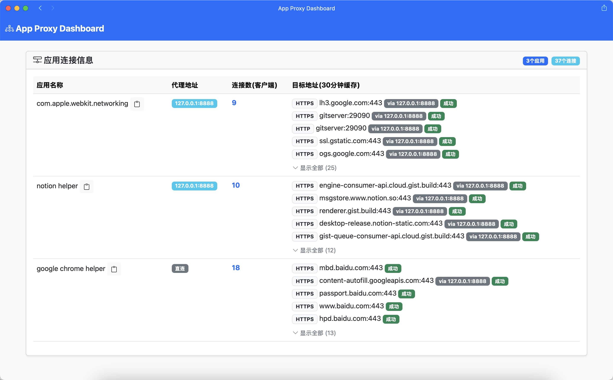

# 应用代理服务器

这是一个基于应用程序的http代理转发程序，可以根据应用程序名称自动将流量转发到指定的代理服务器。它能够智能识别不同应用的网络请求，并根据配置将其转发到不同的代理服务器。

## 预览




## 主要特性

- **代理路由**：根据应用程序名称或域名自动将流量转发到指定的代理服务器
- **域名匹配**：支持精确域名和通配符域名匹配（如 *.google.com ｜ api.google.com）
- **应用识别**：通过 lsof 命令识别发起请求的应用程序名称。
- **系统代理集成**：自动配置和管理系统代理设置
- **实时监控**：内置 Dashboard 监控请求状态和应用流量
- **热重载配置**：支持配置文件热重载，无需重启服务
- **优雅退出**：自动清理系统代理设置和活动连接
- **详细日志**：多级别日志记录，支持文件和控制台输出
- **高性能**：使用 Node.js 异步 I/O，支持大量并发连接

## 系统要求

- macOS 操作系统
- Node.js 14.0 或更高版本

## 安装

### 从源码安装

1. 克隆代码仓库:
```bash
git clone https://github.com/yourusername/app-proxy-nodejs.git
cd app-proxy-nodejs
```

2. 安装依赖:
```bash
npm install
```

3. 全局安装(开发模式):
```bash
npm link
```

现在你可以在任何目录使用 `app-proxy` 命令启动服务。

### 卸载

如果需要卸载全局链接:
```bash
npm unlink -g app-proxy
```

## 配置

配置文件位于 `~/.app-proxy/config.yml`，首次运行时会自动创建。主要配置项包括：

```yaml
# 服务器配置
server:
  host: "127.0.0.1"    # 监听地址
  port: 8080           # 监听端口
  backlog: 1024        # TCP 连接队列大小
  excluded_services:   # 不设置代理的网络服务
    - "Thunderbolt Bridge"

# 基于域名的代理映射配置
proxy_domain_map:
  "10.20.30.1:8888":   # 代理服务器地址
    - "*.google.com"   # 支持通配符域名
    - "github.com"     # 精确域名匹配

# 基于应用程序的代理映射配置
proxy_app_map:
  "10.20.30.1:8888":   # 代理服务器地址
    - "com.apple.webkit.networking"  # 应用标识符
    - "code helper (plugin)"
  "127.0.0.1:8081":
    - "firefox"

# 日志配置
logging:
  console:
    enabled: true
    level: info
  file:
    directory: logs
    max_size: 10m
    max_files: 5

# Dashboard配置
dashboard:
  enabled: true
  port: 8081
  host: "127.0.0.1"
```

## 代理规则优先级

1. 域名规则优先于应用规则
2. 通配符域名支持以下格式：
   - `*.domain.com`: 匹配所有子域名和主域名
   - `specific.domain.com`: 精确匹配指定域名

## 使用方法

### 命令行选项

```bash
app-proxy [options]

选项：
  --port <number>     指定服务器端口
  --open-config       打开配置文件
  -h, --help         显示帮助信息
```

### 启动服务

```bash
# 使用默认配置启动
app-proxy

# 指定端口启动
app-proxy --port 8888

# 打开配置文件
app-proxy --open-config
```

### Dashboard 访问

启动服务后，可以通过浏览器访问 `http://localhost:8081` 查看代理状态和流量统计。

## 日志说明

日志文件默认保存在 `~/.app-proxy/logs` 目录：

- `error.log`: 错误日志
- `warning.log`: 警告日志
- `combined.log`: 综合日志

## 常见问题

1. **获取应用名称失败**
   - 检查 lsof 命令是否可用

2. **端口被占用**
   - 使用 `--port` 参数指定其他端口
   - 检查并关闭占用端口的程序

3. **系统代理设置失败**
   - 检查网络设置是否被其他程序锁定

## 注意事项

1. 修改配置文件后会自动重载服务
2. 关闭程序时会自动清理系统代理设置
3. 建议将频繁访问的应用或域名添加到代理映射中
4. 域名规则优先于应用规则，请合理配置以避免冲突

## 许可证

Apache license 2.0
